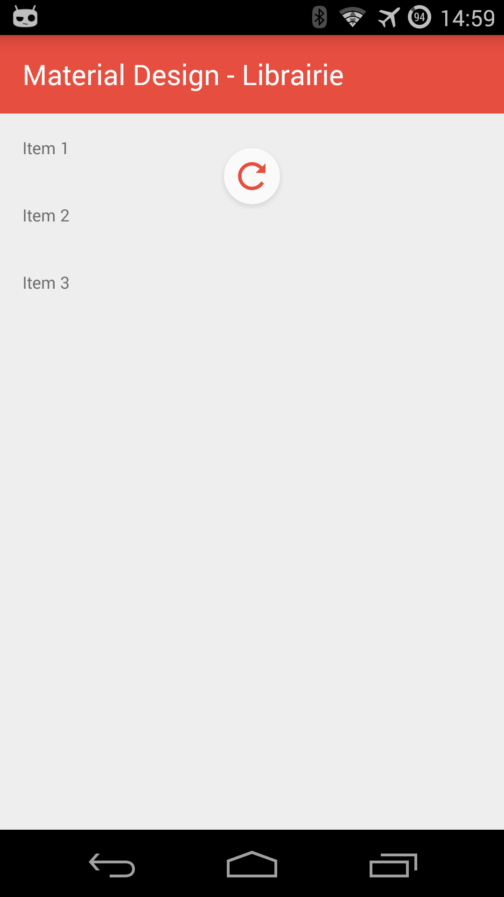
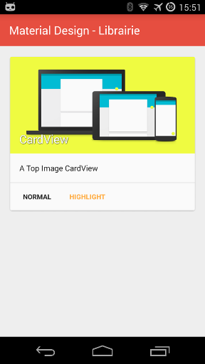

Material Design Library
====================


### Description
A library that helps developers creating their Android Application with Material Design.  
It offers a lot of Material Design classes easily to use like a CardView or a NavigationDrawerActivity that creates an Activity with a Material Design NavigationDrawer.

### Demo
[](https://play.google.com/store/apps/details?id=com.blunderer.materialdesignlibrary.sample)

 


### Usage

**1.** Add the dependency in your build.gradle.

```groovy
dependencies {
    compile 'com.blunderer:materialdesignlibrary:1.1.1'
}
```

**2.** In your *values/styles.xml* file, change the parent style and add your own colorPrimary/colorPrimaryDark colors:

```xml
<style name="AppTheme" parent="@style/MaterialDesignLibraryTheme">
    <item name="colorPrimary">#3f51b5</item>
    <item name="colorPrimaryDark">#303f9f</item>
</style>
```

Or if you want the Light Theme:  

```xml
<style name="AppTheme" parent="@style/MaterialDesignLibraryTheme.Light">
    <item name="colorPrimary">#3f51b5</item>
    <item name="colorPrimaryDark">#303f9f</item>
</style>
```

**3.** Then you can:  
**-** *Extend your activity* by one of mine (*each activity will be in Material Design*):  

  * **Activity**  
    Your Activity will be a basic Activity with Material Design.

  * **ListViewActivity**  
  Your Activity will contain a ListView (with or not the Material Design Pull To Refresh).

  * **NavigationDrawerActivity**  
  Your Activity will contain a NavigationDrawer.

  * **ViewPagerActivity**  
  Your Activity will contain a ViewPager (with or not the indicator).

  * **ViewPagerWithTabsActivity**  
  Your Activity will contain a ViewPager with tabs.

##### Example:  
```java
import com.blunderer.materialdesignlibrary.activities.NavigationDrawerActivity;

public class MyActivity extends NavigationDrawerActivity {

    @Override
    protected NavigationDrawerTopHandler getNavigationDrawerTopHandler() {
        return new NavigationDrawerTopHandler()
                .addItem(R.string.title_item1, new MainFragment())
                .addItem(R.string.title_item2, new MainFragment())
                .addSection(R.string.title_section2)
                .addItem(R.string.title_item3, new MainFragment())
                .addItem(R.string.title_item4, new MainFragment());
    }

    @Override
    protected NavigationDrawerBottomHandler getNavigationDrawerBottomHandler() {
        return new NavigationDrawerBottomHandler()
                .addSettings(new View.OnClickListener() {

                    @Override
                    public void onClick(View view) {
                        Intent intent = new Intent(getApplicationContext(), SettingsActivity.class);
                        startActivity(intent);
                    }

                })
                .addHelpAndFeedback(new View.OnClickListener() {

                    @Override
                    public void onClick(View view) {
                        Intent intent = new Intent(getApplicationContext(), HelpAndFeedbackActivity.class);
                        startActivity(intent);
                    }

                });
    }

    @Override
    protected int defaultNavigationDrawerItemSelectedPosition() {
        return 0;
    }

}
```

**-** Or use my CardView:

  * **Normal CardView**  
  Your CardView will be a basic CardView.

  * **Left Image CardView**  
  Your CardView will contain an image on the left.

  * **Top Image CardView**  
  Your CardView will contain an image on the top.

##### Example:  
```xml
<com.blunderer.materialdesignlibrary.views.CardView
        android:layout_width="match_parent"
        android:layout_height="wrap_content"
        app:mdl_title="CardView"
        app:mdl_description="A Left Image CardView"
        app:mdl_normalButton="Normal"
        app:mdl_highlightButton="Highlight"
        app:mdl_imagePosition="left"
        app:mdl_image="@drawable/image" />
```

### Developed by

 * Denis Mondon - <blundererandroid@gmail.com>